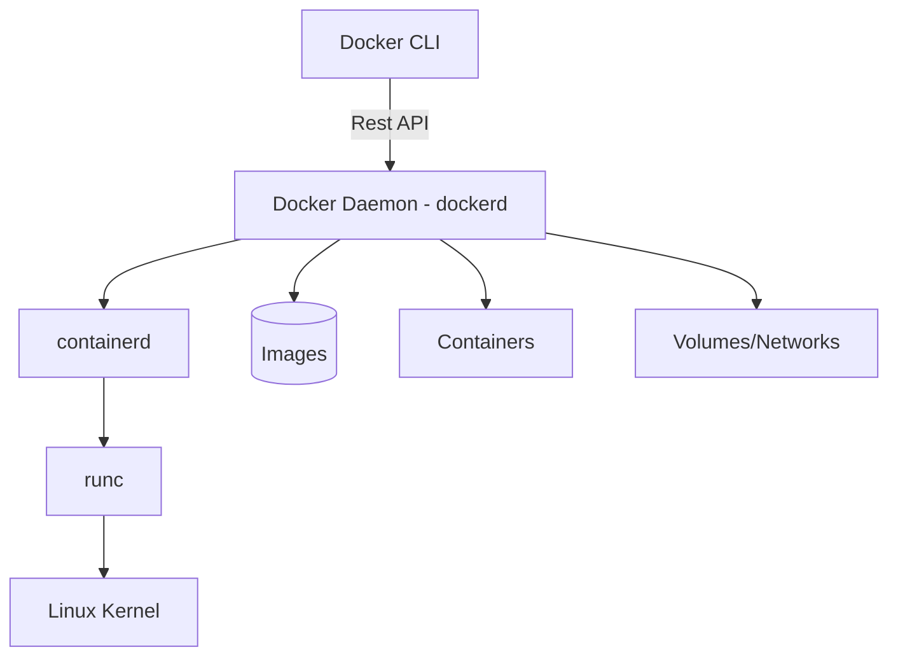
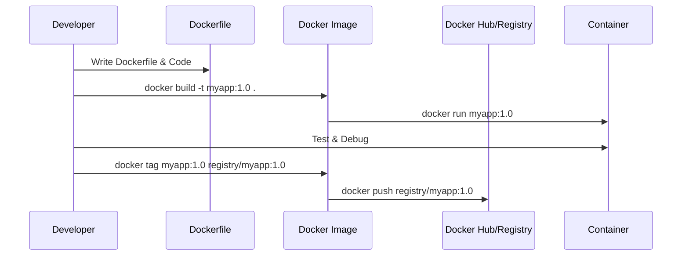

# 🐳 Docker Master Handbook: The Ultimate Developer's Guide

A comprehensive, professionally curated documentation of Docker fundamentals, CLI operations, and best practices designed for backend developers.

---

## 📋 Table of Contents
1. [🏗️ Fundamentals & Architecture](#-fundamentals--architecture)
2. [💻 Docker CLI Reference](#-docker-cli-reference)
3. [📝 Dockerfile Mastery](#-dockerfile-mastery)
4. [💾 Storage & Persistence](#-storage--persistence)
5. [🌐 Networking & Service Discovery](#-networking--service-discovery)
6. [📦 Docker Compose](#-docker-compose)
7. [🧹 Maintenance & Cleanup](#-maintenance--cleanup)
8. [🚀 Typical Developer Workflow](#-typical-developer-workflow)
9. [🐳 Appendix A: Complete CLI Cheat Sheet](#-appendix-a-complete-cli-cheat-sheet)
10. [📜 Appendix B: Detailed Dockerfile Syntax Reference](#-appendix-b-detailed-dockerfile-syntax-reference)

---

## 🏗️ Fundamentals & Architecture

### What is Docker?
Docker is an open-source platform that enables developers to package applications and their dependencies into a standardized unit called a **container**. Unlike Virtual Machines, containers share the host's OS kernel, making them lightweight and fast.

### Containers vs. Virtual Machines
| Feature | Virtual Machine | Docker Container |
| :--- | :--- | :--- |
| **OS** | Full Guest OS (Heavy) | Shared Host Kernel (Light) |
| **Size** | Gigabytes | Megabytes |
| **Startup** | Minutes | Seconds |
| **Performance** | Lower (Hypervisor overhead) | Near-native |

### Docker Architecture


---

## 💻 Docker CLI Reference

### 1. Core System Commands
| Command | Description |
| :--- | :--- |
| `docker version` | Show client and server versions |
| `docker info` | Display system-wide information |
| `docker help` | List all commands |
| `docker <cmd> --help` | Help for a specific command |

### 2. Image Management
Images are read-only templates used to create containers.
- `docker images` : List all local images.
- `docker pull <image>` : Download an image from a registry.
- `docker build -t <name>:<tag> .` : Build an image from a Dockerfile.
- `docker rmi <image>` : Remove a local image.
- `docker image prune` : Remove unused images.

### 3. Container Operations
Containers are running instances of images.
- `docker run -d -p 80:80 <image>` : Run container in background with port mapping.
- `docker ps` : List running containers.
- `docker ps -a` : List all containers (including stopped ones).
- `docker stop <container>` : Gracefully stop a container.
- `docker start <container>` : Start a stopped container.
- `docker rm <id>` : Remove a container.
- `docker logs -f <id>` : Follow container logs in real-time.

---

## 📝 Dockerfile Mastery

The `Dockerfile` is a script containing a series of instructions on how to build a Docker image.

### Essential Instructions
> [!TIP]
> Always use a specific version for your base image (e.g., `node:18` instead of `node:latest`) to ensure build reproducibility.

| Instruction | Definition | Example |
| :--- | :--- | :--- |
| `FROM` | Sets the base image. | `FROM python:3.9-slim` |
| `WORKDIR` | Sets the working directory inside the container. | `WORKDIR /app` |
| `COPY` | Copies files from host to container. | `COPY . .` |
| `RUN` | Executes commands during the build phase. | `RUN npm install` |
| `ENV` | Sets environment variables. | `ENV NODE_ENV=production` |
| `EXPOSE` | Documents the port the app listens on. | `EXPOSE 8080` |
| `CMD` | Default command when the container starts. | `CMD ["npm", "start"]` |
| `ENTRYPOINT` | Configures the container as an executable. | `ENTRYPOINT ["dotnet", "app.dll"]` |

### Multi-Stage Builds
Multi-stage builds allow you to use multiple `FROM` statements to create a smaller, more secure final image by leaving behind build-time dependencies.

```dockerfile
# Stage 1: Build
FROM node:18 AS builder
WORKDIR /app
COPY . .
RUN npm install && npm run build

# Stage 2: Runtime
FROM node:18-alpine
WORKDIR /app
COPY --from=builder /app/dist ./dist
CMD ["node", "server.js"]
```

---

## 💾 Storage & Persistence

Containers are **ephemeral** (data is lost when the container is deleted). To save data, use **Volumes**.

### Volume Commands
- `docker volume create <name>` : Create a managed volume.
- `docker volume ls` : List all volumes.
- `docker volume inspect <name>` : See where the volume is stored on the host.

### Common Database Data Paths
| Database | Default Internal Path |
| :--- | :--- |
| **PostgreSQL** | `/var/lib/postgresql/data` |
| **MySQL** | `/var/lib/mysql` |
| **MongoDB** | `/data/db` |
| **Redis** | `/data` |

---

## 🌐 Networking & Service Discovery

### Service Names vs Localhost
> [!IMPORTANT]
> In a Docker network, containers communicate using their **Service Name** (defined in Compose) or **Container Name**, NOT `localhost`.

**Scenario:** A Backend container connecting to a Database.
- ❌ `connectionUrl: "localhost:5432"`
- ✅ `connectionUrl: "database_service:5432"`

---

## 📦 Docker Compose

Docker Compose is a tool for defining and running multi-container applications using a `docker-compose.yml` file.

```yaml
version: '3.8'
services:
  web:
    build: .
    ports:
      - "3000:3000"
    depends_on:
      - db
  db:
    image: postgres:15
    environment:
      POSTGRES_PASSWORD: example_pass
    volumes:
      - pgdata:/var/lib/postgresql/data

volumes:
  pgdata:
```

### Common Compose Commands
- `docker compose up -d` : Create and start containers in the background.
- `docker compose down` : Stop and remove containers, networks, and images.
- `docker compose logs -f` : View logs for all services.

---

## 🧹 Maintenance & Cleanup

Keep your system clean to save disk space.

| Goal | Command |
| :--- | :--- |
| **Nuclear Option** | `docker system prune -a --volumes` |
| **Clean Containers** | `docker container prune` |
| **Clean Images** | `docker image prune` |
| **Clean Volumes** | `docker volume prune` |

---

## 🚀 Typical Developer Workflow



---

## 🐳 Appendix A: Complete CLI Cheat Sheet

### 1. Docker Core Commands
```bash
docker --version                     # Show Docker version
docker version                       # Show client and server versions
docker info                          # Display Docker system information
docker help                          # List all Docker commands
docker <command> --help              # Show help for a specific command
```

### 2. Docker Image Commands
```bash
docker images                        # List local images
docker image ls                      # Alternative command to list images
docker image pull <image>            # Download image from registry
docker image push <image>            # Upload image to registry
docker image build -t name:tag .     # Build image from Dockerfile
docker image inspect <image>         # Show detailed image information
docker image history <image>         # Show image layer history
docker image rm <image>              # Remove an image
docker image prune                   # Remove unused images
docker image tag src:tag dest:tag    # Tag image with new name
docker image save -o img.tar <image> # Save image to tar file
docker image load -i img.tar         # Load image from tar file
```

### 3. Container Commands
```bash
docker run <image>                   # Create and start container
docker run -d <image>                # Run container in background
docker run -it <image> bash          # Run container interactively
docker create <image>                # Create container without starting
docker start <container>             # Start stopped container
docker stop <container>              # Stop running container
docker restart <container>           # Restart container
docker pause <container>             # Pause container processes
docker unpause <container>           # Resume paused container
docker kill <container>              # Force stop container
docker rm <container>                # Remove container
docker rename old new                # Rename container
docker update <container>            # Update container resource limits
```

### 4. Container Inspection & Monitoring
```bash
docker ps                            # List running containers
docker ps -a                         # List all containers
docker ps -q                         # Show container IDs only
docker inspect <container>           # Show container metadata
docker logs <container>              # Display container logs
docker logs -f <container>           # Follow container logs live
docker top <container>               # Show processes in container
docker stats                         # Show real-time container resource usage
docker events                        # Stream Docker events
```

### 5. Container Interaction
```bash
docker exec -it <container> bash     # Run command inside container
docker exec <container> <cmd>        # Execute command inside container
docker attach <container>            # Attach terminal to container
docker cp file container:/path       # Copy file to container
docker cp container:/path file       # Copy file from container
```

### 6. Volume Commands (Persistent Storage)
```bash
docker volume create <name>          # Create volume
docker volume ls                     # List volumes
docker volume inspect <name>         # Show volume details
docker volume rm <name>              # Remove volume
docker volume prune                  # Remove unused volumes
```

### 7. Network Commands
```bash
docker network ls                    # List networks
docker network create <name>         # Create network
docker network inspect <name>        # Show network details
docker network connect net cont      # Connect container to network
docker network disconnect net cont   # Disconnect container from network
docker network rm <name>             # Remove network
docker network prune                 # Remove unused networks
```

### 8. Docker System Commands
```bash
docker system df                     # Show Docker disk usage
docker system events                 # Stream system events
docker system info                   # Show system-wide information
docker system prune                  # Remove unused objects
docker system prune -a               # Remove all unused images
```

### 9. Docker Compose Commands
```bash
docker compose up                    # Start services
docker compose up -d                 # Start services in background
docker compose down                  # Stop and remove services
docker compose start                 # Start existing services
docker compose stop                  # Stop running services
docker compose restart               # Restart services
docker compose ps                    # List compose containers
docker compose logs                  # View service logs
docker compose build                 # Build compose images
docker compose pull                  # Pull service images
```

### 10. Cleanup Commands
```bash
docker container prune               # Remove stopped containers
docker image prune                   # Remove unused images
docker volume prune                  # Remove unused volumes
docker network prune                 # Remove unused networks
docker system prune                  # Remove everything unused
```

---

## 📜 Appendix B: Detailed Dockerfile Syntax Reference

This guide explains the primary **Dockerfile instructions** in detail, providing context for backend usage.

### FROM
Defines the base image used to build your image.
```dockerfile
FROM ubuntu:22.04
```
*   **Mandatory**: Every Dockerfile must start with `FROM`.
*   **Role**: Defines the OS/runtime layer your application runs on.

### WORKDIR
Sets the working directory inside the container.
```dockerfile
WORKDIR /app
```
*   **Equivalent**: `cd /app`
*   **Persistent**: All following instructions (RUN, COPY, CMD) run inside this directory.

### COPY vs ADD
Both instructions move files from the host to the container.

**COPY**:
```dockerfile
COPY package.json /app/package.json
```
*   **Recommended**: Use for simple file/directory transfers.

**ADD**:
```dockerfile
ADD https://example.com/file.tar.gz /app/
```
*   **Extended**: Supports URLs and automatic archive extraction.

### RUN
Executes commands during the image build process.
```dockerfile
RUN apt-get update && apt-get install -y curl
```
*   **Layering**: Each `RUN` creates a new image layer. Chain commands with `&&` to reduce image size.

### CMD vs ENTRYPOINT
Defines how the container runs.

**CMD**:
```dockerfile
CMD ["node", "server.js"]
```
*   **Overridable**: `docker run <image> node other.js` replaces the `CMD`.

**ENTRYPOINT**:
```dockerfile
ENTRYPOINT ["python"]
```
*   **Fixed**: The command cannot be easily overridden. Arguments passed to `docker run` are appended to the entrypoint.

### EXPOSE
Documents which port the application uses.
```dockerfile
EXPOSE 5000
```
*   **Note**: This is documentation only. Use `docker run -p 5000:5000` to actually publish the port.

### ENV vs ARG
Handling variables.

| Instruction | Context | Stored in Image? |
| :--- | :--- | :--- |
| **ARG** | Build-time | No |
| **ENV** | Runtime | Yes |

### USER
Improves security by running as a non-root user.
```dockerfile
USER node
```

### HEALTHCHECK
Tells Docker how to test the container to check if it's still working.
```dockerfile
HEALTHCHECK CMD curl --fail http://localhost:3000 || exit 1
```

---

> [!NOTE]
> This documentation is a living document. For advanced internals like `namespaces` or `cgroups`, refer to the official Docker Documentation.
